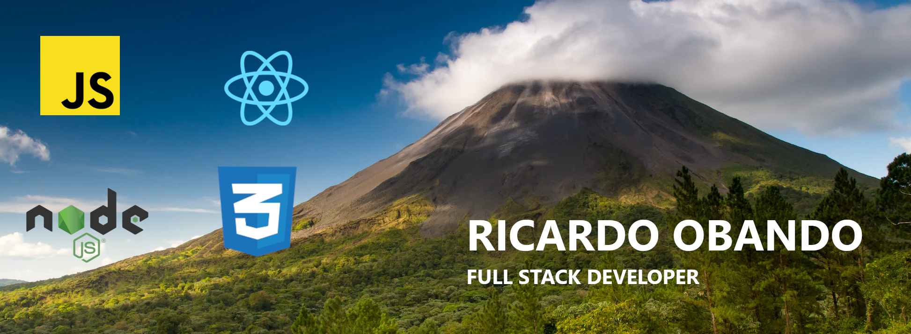

   
   <h3 align="center">Hola,soy Ricardo !</h3>
   
  

    <a href="https://www.linkedin.com/in/ricardo-obando-villegas-824185242">
      LinkedIn
    </a>
  

Soy Ricardo un entusiasta desarrollador Full stack que apasionado por aprender nuevas maneras de desarrollar mejores productos tecnológicos. He elaborado diferentes proyectos que puedes que te invito a revisar.

<h2>Languages and tools:</h2>
         

 
 

	

ricardo.obando116@gmail.com
https://www.linkedin.com/in/ricardo-obando-villegas-824185242